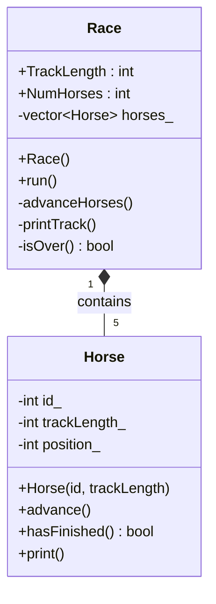

# CompSci121OOPHorseRace

```mermaid
classDiagram
  class Horse {
    -int id_
    -int trackLength_
    -int position_
    +Horse(id, trackLength)
    +advance()
    +hasFinished() bool
    +print()
  }
  class Race {
    +TrackLength : int
    +NumHorses : int
    -vector~Horse~ horses_
    +Race()
    +run()
    -advanceHorses()
    -printTrack()
    -isOver() bool
  }
  Race "1" *-- "5" Horse : contains
```
