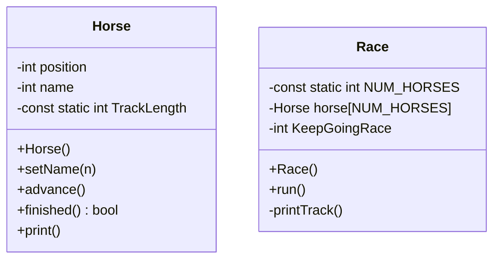

# CompSci121OOPHorseRace

```mermaid
classDiagram
  class Horse {
    -int position
    -int name
    -const static int TrackLength
    +Horse()
    +setName(n)
    +advance()
    +finished() bool
    +print()
  }
  class Race {
    -const static int NUM_HORSES
    -Horse horse[NUM_HORSES]
    -int KeepGoingRace
    +Race()
    +run()
    -printTrack()
  }
```
